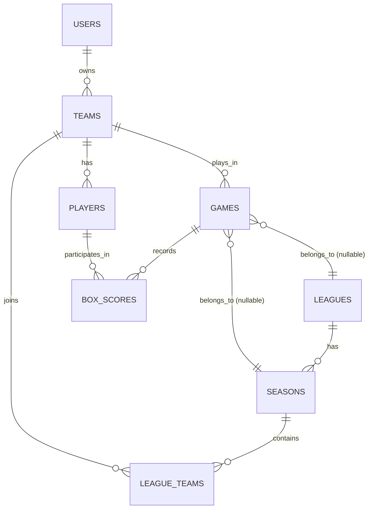

# Proposed Database Schema Updates for User-Team Connection and League Structure

## Current Schema Review

The existing schema has:

- `usersTable`: Basic user info, no connections yet.
- `teamsTable`: Teams with name and creation time, no owner.
- `playersTable`: Players linked to teams via `teamId` (one team per player).
- `gamesTable`: Games between two teams.
- `boxScoresTable`: Per-player stats per game.

Inconsistencies/Notes:

- Players are already tied to one team (unique index on teamId).
- No direct user-team link.
- No league or season structure.
- Stats are game-level; no aggregation for leagues or global.

## 1. User-Team Connection (Single-Player Mode)

For single-player start: Each user owns one primary team. Add a foreign key from `teams` to `users`.

**Modification to `teamsTable`**:

- Add `userId: int("user_id").references(() => usersTable.id, { onDelete: "restrict" }).notNull(),`
- This assumes one team per user initially. For future multi-team ownership, make it nullable or use a junction table `userTeams` (userId, teamId, isPrimary).

Index: Add index on `userId` for queries.

This connects users to teams directly. Users can create/manage their team and players.

## 2. League, Season, and Team Membership Structure

For multi-team/leagues:

- Leagues contain multiple teams.
- Seasons per league for tracking over time.
- Teams join leagues/seasons (many-to-many).

**New Tables**:

### leaguesTable

```typescript
export const leaguesTable = sqliteTable("leagues", {
  id: int("id").primaryKey({ autoIncrement: true }),
  name: text("name").notNull().unique(),
  description: text("description"),
  createdAt: text("created_at").default(sql`CURRENT_TIMESTAMP`),
});
```

### seasonsTable

```typescript
export const seasonsTable = sqliteTable(
  "seasons",
  {
    id: int("id").primaryKey({ autoIncrement: true }),
    leagueId: int("league_id")
      .notNull()
      .references(() => leaguesTable.id, { onDelete: "cascade" }),
    name: text("name").notNull(), // e.g., "2024 Spring"
    startDate: text("start_date"),
    endDate: text("end_date"),
    isActive: int("is_active").default(1),
    createdAt: text("created_at").default(sql`CURRENT_TIMESTAMP`),
  },
  (table) => ({
    leagueUnique: uniqueIndex("seasons_league_name_unique").on(
      table.leagueId,
      table.name
    ),
  })
);
```

### leagueTeamsTable (Junction for teams in leagues/seasons)

```typescript
export const leagueTeamsTable = sqliteTable(
  "league_teams",
  {
    id: int("id").primaryKey({ autoIncrement: true }),
    seasonId: int("season_id")
      .notNull()
      .references(() => seasonsTable.id, { onDelete: "cascade" }),
    teamId: int("team_id")
      .notNull()
      .references(() => teamsTable.id, { onDelete: "cascade" }),
    joinDate: text("join_date").default(sql`CURRENT_TIMESTAMP`),
  },
  (table) => ({
    seasonTeamUnique: uniqueIndex("league_teams_season_team_unique").on(
      table.seasonId,
      table.teamId
    ),
  })
);
```

This allows teams to join specific seasons. Leagues can have historical seasons.

## 3. Standings and Performance Tracking

To simplify and avoid dedicated caching tables for now, add fields to `gamesTable` for league/season context and rely on queries for standings and stats. This reduces schema complexity while enabling the required functionality.

- **Games Link to League/Season**: Add `leagueId` and `seasonId` to `gamesTable` for league games (nullable for single-player/exhibition). LeagueId can be derived from season, but including it allows direct filtering.

  - Modifications:
    - `leagueId: int("league_id").references(() => leaguesTable.id, { onDelete: "set null" }),`
    - `seasonId: int("season_id").references(() => seasonsTable.id, { onDelete: "set null" }),`

- **Standings**: Query `gamesTable` filtered by `seasonId` (where both teams are in the season via `leagueTeamsTable`). Aggregate wins/losses for teams in that season. Example query: Count wins where `winnerTeamId = teamId` and both teams in season.

  - No `standingsTable` needed initially; compute on-the-fly. Add later if performance issues arise (e.g., for large leagues).

- **Player Performance**:
  - **League/Season-Specific**: Query `boxScoresTable` joined with `gamesTable` filtered by `seasonId`. Aggregate stats (e.g., SUM(hits)/SUM(atBats) for AVG) for players whose team is in the season.
  - **Global Stats**: Query without season filter, aggregating across all games for a player.
  - No dedicated `playerSeasonStatsTable` needed; use views or computed queries. Add materialized tables later if frequent access requires optimization.

This approach:

- Enables filtering games by league/season for both team standings and player stats.
- Keeps the schema lean for a starting single-player app.
- Scalable: Add caching tables (standings, player stats) in future iterations if query performance becomes a bottleneck.
- For single-player: Leave leagueId/seasonId null for exhibition games.

## ER Diagram



## Implementation Notes

- For single-player: Users create a team (linked via userId), add players, simulate games against AI teams (no league; seasonId/leagueId null).
- Migration: Use Drizzle to generate SQL for new tables/columns.
- Queries: Use joins for user-owned teams; filter games by seasonId for league standings/stats.
- Future: Add caching tables (standings, playerSeasonStats) if needed for performance; user-league admin roles.

This simplified structure is scalable, normalized, and supports single/multi-player evolution without premature optimization.
